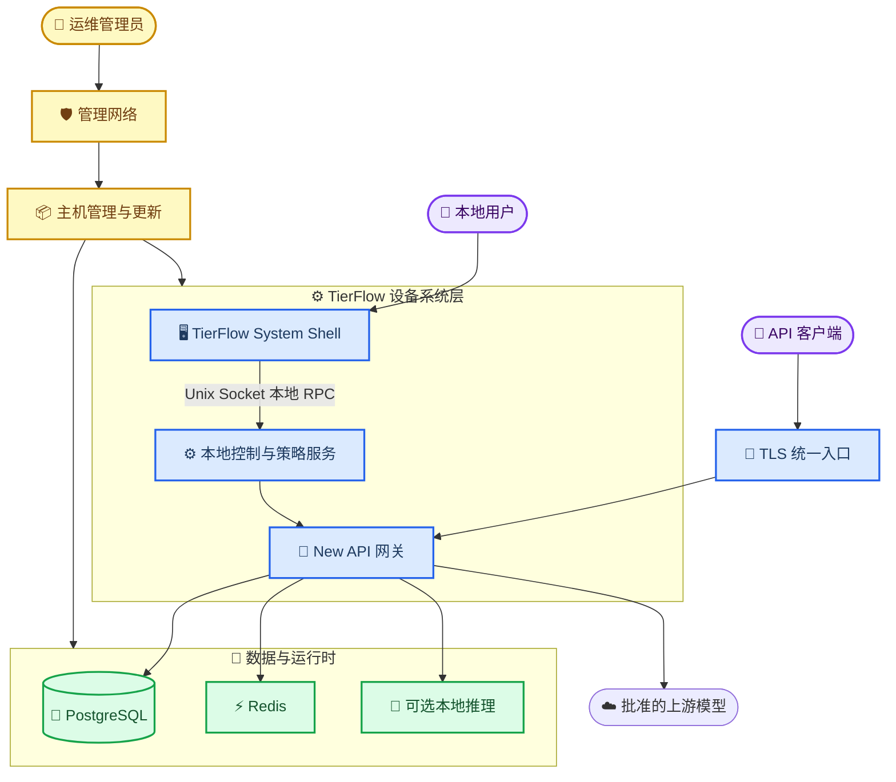
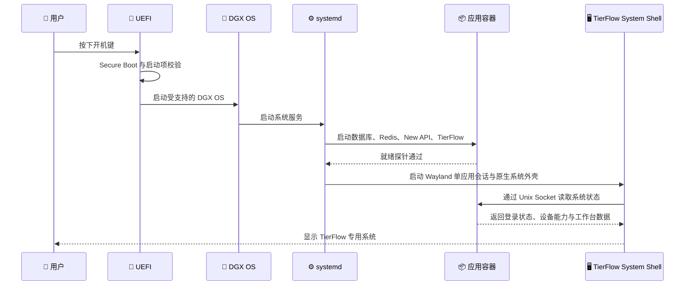
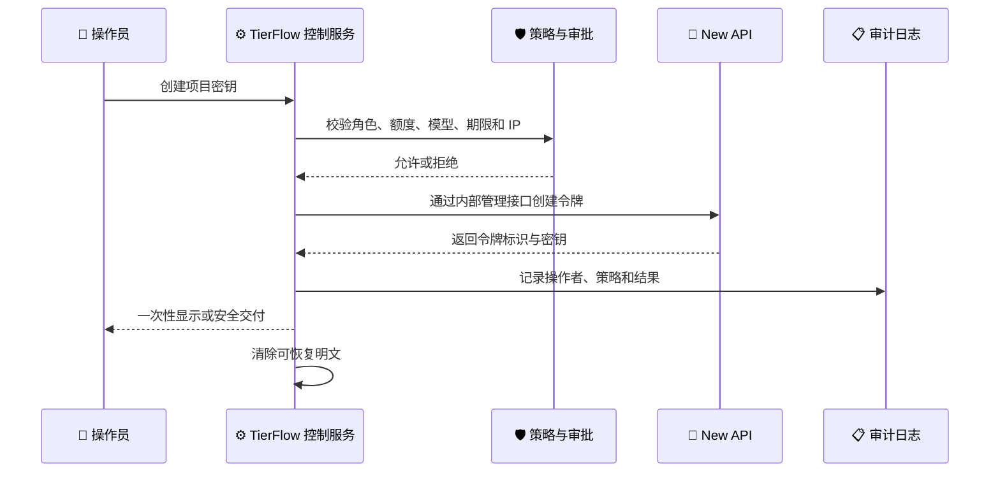

# DGX Spark 智能体调度一体机完整方案

_面向基于 New API 的专用 AI API 创建、分发与调度设备系统，版本日期：2026-08-10_

---

## 📋 方案结论

建议把产品定义为一台真正的 **AI 调度专用设备**，而不是“在 DGX Spark 上打开一个网页”。最终形态如下：

- 以 NVIDIA 官方 DGX OS 为受支持的操作系统底座
- 使用 `cloud-init` 和签名安装包完成工厂预装与首次启动配置
- 使用 `systemd + Docker Compose` 管理应用，不在单机上引入 Kubernetes
- 使用 Qt 6/QML 构建原生 `TierFlow System Shell`，由系统外壳承载全部本地用户操作
- 将 New API 放在内部容器网络中，只承担渠道、令牌、额度、模型路由和用量结算
- 使用独立 Wayland 单应用系统会话，开机自动进入 TierFlow System Shell，不启动普通 GNOME 桌面
- 将设备会话身份和业务身份分离：设备自动进入系统外壳，敏感业务操作仍要求用户认证
- 使用默认拒绝的网络策略、受控 USB、Secure Boot、磁盘加密和签名更新
- 提供应用级回滚、数据库备份以及 NVIDIA 官方恢复介质三层恢复能力

> **目标体验：** 用户按下开机键后，只看到品牌启动画面、TierFlow 系统加载界面和系统工作台；看不到 Linux 桌面、任务栏、终端、文件管理器、浏览器、网址或 New API 原生管理后台。

这里所说的“系统”不是从零开发 Linux 内核或自行维护一套发行版，而是在 NVIDIA 支持的 DGX OS 之上构建完整的专用设备系统层：包含原生系统外壳、设备控制、业务服务、更新、恢复、安全策略和生命周期管理。对用户而言它是一套独立系统；对工程团队而言仍保留 DGX OS 的驱动、固件和官方支持路径。

### 核心技术选择

| 领域 | 推荐方案 | 原因 |
| --- | --- | --- |
| 操作系统 | DGX OS | 保留 NVIDIA 驱动、固件和官方更新路径 |
| 设备初始化 | 官方镜像 + `cloud-init` | 支持批量、可重复和无人值守预装 |
| 服务编排 | `systemd + Docker Compose` | 单机可靠、简单、容易恢复 |
| 用户界面 | Qt 6/QML 原生 TierFlow System Shell | Arm64/Linux 支持成熟，可构建真正的系统级窗口、触控和设备交互 |
| API 网关 | New API 内部服务 | 复用渠道、令牌、额度和路由能力 |
| 本地显示 | Cage/Weston + TierFlow System Shell | 单应用 Wayland 会话，无浏览器、桌面和通用窗口入口 |
| 数据库 | PostgreSQL | 更适合生产审计、备份和长期维护 |
| 缓存 | Redis | 承载 New API 缓存与限流状态 |
| 边缘入口 | Caddy 或 Nginx | 统一 TLS、路由、限流和安全头 |
| 应用更新 | 签名 OCI 镜像 + 蓝绿切换 | 可验证、可回滚、避免半更新状态 |

## 🏗️ 总体架构

DGX Spark 使用 Arm64 处理器、128 GB 统一内存，并预装支持 GPU 容器的 NVIDIA 软件栈；所有第三方镜像都必须验证或构建 `linux/arm64` 版本。DGX Spark 提供 1 TB 或 4 TB NVMe 配置，生产一体机建议采用 4 TB 版本，为本地模型、日志、数据库和回滚包预留空间。[^1]



### 服务职责

| 服务 | 是否对用户开放 | 职责 |
| --- | --- | --- |
| `tierflow-edge` | 是，仅 `443` | 面向 API 客户端提供 TLS、限流、安全头和请求大小限制 |
| `tierflow-shell` | 仅本机显示器 | 原生系统工作台、触控交互、登录、设备状态和业务操作 |
| `tierflow-control` | 默认仅本机 | 通过 Unix Socket 向系统外壳提供租户、项目、密钥生命周期、审批、审计和设备能力 |
| `new-api` | 仅内部/受控中继接口 | 渠道、模型路由、额度、计费、上游重试 |
| `postgres` | 否 | 业务数据、New API 数据、审计索引 |
| `redis` | 否 | 缓存、分布式锁、限流和短期状态 |
| `model-runtime` | 可选，仅内部 | 运行已验证的本地模型服务 |
| `telemetry-agent` | 否 | 健康状态、资源、审计和告警 |
| `backup-agent` | 否 | 加密备份和恢复验证 |

New API 原生前端不属于产品系统，也不向本地用户显示；其管理端口不直接暴露。TierFlow System Shell 通过本地控制服务间接调用 New API，从而在不大规模改动 New API 的前提下形成独立的设备系统体验，并降低持续跟随上游版本的成本。

## 🚀 开机即进入系统

### 启动链



### 操作系统会话设计

1. 创建专用系统用户 `tierflow-shell`，不授予 `sudo`、Docker、SSH、串口或设备管理权限。
2. 不自动登录 GNOME 桌面；由 `systemd` 在 `tty1` 上直接启动 Cage 或 Weston 单应用 compositor。
3. compositor 只运行签名的原生 TierFlow System Shell：

   ```text
   cage -- /opt/tierflow/current/bin/tierflow-shell --fullscreen
   ```

4. 系统外壳使用 Qt 6/QML 构建，不集成地址栏、通用网页浏览、扩展系统、开发者工具或任意程序启动能力。
5. 系统外壳资源随签名安装包交付；会话缓存和临时目录放在 `tmpfs`，重启后清理。
6. 禁用未使用的 `getty`、桌面快捷键、任务切换、右键菜单以及虚拟终端入口。
7. `tierflow-shell.service` 设置 `Restart=always`；系统外壳或 compositor 崩溃后自动恢复。
8. 如果后台服务未就绪，系统外壳显示内置的“系统正在恢复”安全界面，而不是暴露系统错误、桌面或通用维护入口。

### 系统服务依赖

建议按以下逻辑设置 `systemd`：

```text
network-online.target
  -> docker.service
  -> tierflow-stack.service
  -> tierflow-readiness.service
  -> tierflow-shell.service
```

`tierflow-readiness.service` 至少检查 PostgreSQL、Redis、New API、控制服务和系统外壳所需的本地 RPC；数据库迁移完成且所有服务健康后，才允许系统外壳进入工作台。

### 身份分离

设备可以无人值守进入 TierFlow System Shell，但业务系统不应默认以超级管理员身份登录。推荐：

- 普通使用场景：平台登录页 + 账号密码/Passkey/OIDC
- 高安全场景：FIDO2 安全密钥或员工卡认证
- 展示或单租户场景：自动进入低权限工作台，敏感操作仍要求二次认证
- 系统维护：只能从管理网络远程进入，不能从 TierFlow System Shell 打开通用终端

## 🔑 API Key 创建与分发

New API 当前已经具备令牌额度、有效期、模型限制、分组、IP 白名单、跨组重试、启停和用量查询能力，适合作为底层令牌与路由引擎。[^2] 但不建议让 TierFlow System Shell 直接调用 New API 的管理员接口。

### 专用工作流



### 用户可见功能

- 创建、暂停、恢复、轮换和吊销 API Key
- 设置名称、项目、调用额度、有效期、模型集合、来源 IP 和 QPS
- 查看使用量、错误率、最近调用和费用
- 复制一次、显示二维码或生成一次性下载配置
- 到期提醒、额度提醒和异常调用告警
- 批量发放必须经过审批，并限制单次数量

### 必须补充的控制层能力

New API 的普通令牌接口以当前登录用户为边界。若 TierFlow 需要由管理员为指定租户或项目发放密钥，建议增加一个很小的内部管理扩展，而不是直接写 New API 数据库：

- 接口只监听内部容器网络
- 使用 mTLS 或短期服务凭证认证
- 明确指定目标用户、租户、策略和幂等键
- 所有操作进入不可抵赖审计日志
- 不允许任意 SQL 或通用代理调用

更高安全等级下，应把令牌改成“一次显示、不可再次取回”：数据库只保存密钥的 HMAC/哈希和前缀，不再提供永久明文查看接口。上游渠道密钥则使用应用层加密，主密钥由设备硬件能力或企业 KMS 保护。

## 🛡️ 专用设备安全

### 设备与系统硬化

| 风险 | 控制措施 |
| --- | --- |
| 从系统外壳逃逸 | 无普通桌面、单应用 Wayland compositor、原生 Shell 无通用程序启动能力、禁用系统快捷键 |
| USB 启动或重装 | UEFI 管理密码、锁定启动顺序、Secure Boot、封闭或管控 USB 端口 |
| USB 存储窃取数据 | `usbguard` 默认拒绝存储设备，仅放行指定键鼠和维护设备 |
| 本地终端访问 | `tierflow-shell` 用户无 shell 权限，禁用多余 getty，root 禁止直接登录 |
| 磁盘被拆走 | 启用 NVMe 自加密能力或 LUKS；无人值守解锁需结合硬件绑定或网络解锁 |
| 网络扫描攻击 | `nftables` 默认拒绝，仅开放业务 `443` 和受限管理入口 |
| 上游密钥泄漏 | 字段级加密、日志脱敏、禁止在 UI/错误日志中返回完整密钥 |
| 镜像供应链攻击 | 版本固定、镜像 digest、签名验证、SBOM 和漏洞扫描 |
| 恶意应用更新 | 双签名、灰度发布、健康检查、自动回滚 |
| 管理员误操作 | RBAC、二次确认、审批、审计、维护窗口和配置版本历史 |

DGX Spark 的 Secure Boot 默认启用；其 UEFI 也可以同时禁用 Wi-Fi 和 Bluetooth。部署完成并接入有线网络后，建议在 UEFI 中关闭无线功能。[^3]

> ⚠️ **物理安全边界：** 如果攻击者可以长期、不受限制地拆机或更换硬件，仅靠系统外壳无法保证设备安全。商业一体机还应配置防拆标签、机柜锁、端口锁和受控维护流程。

### 网络分区

推荐至少区分三个逻辑平面：

| 平面 | 用途 | 允许访问 |
| --- | --- | --- |
| 业务网络 | API 客户端调用 | 仅 `443`，访问 `/v1/*` 和授权业务接口 |
| 管理网络 | SSH、设备管理、更新、备份 | 仅企业 VPN/WireGuard 或管理 VLAN |
| 上游出口 | 模型供应商、时间、DNS、更新源 | 通过代理和域名/IP 白名单出站 |

具体要求：

- 不对外暴露 New API 的 `3000`、PostgreSQL 或 Redis 端口
- 本地系统外壳通过 Unix Socket 访问控制服务，不依赖网络、域名或浏览器才能显示界面
- SSH 禁用密码登录，只允许短期证书或硬件密钥
- 管理入口不得与普通 API Key 共用认证体系
- 若客户只需离线本地模型，默认关闭互联网出口
- DNS 和 NTP 使用企业批准的服务，避免证书和审计时间漂移

## 📦 DGX Spark 部署方式

### 官方底座与自动预装

DGX OS 是基于 Ubuntu 的 NVIDIA 定制 Linux，包含适配驱动和系统设置。NVIDIA 官方为 DGX Spark 提供 `cloud-init`、定制安装介质、PXE 和首启自动配置路径，适合把它做成批量交付的一体机。[^4]

工厂镜像流程建议为：

1. 取得对应机型的官方 BaseOS/FastOS 或恢复镜像
2. 使用 NVIDIA 支持的定制流程嵌入 `cloud-init` seed
3. 创建设备管理员和 `tierflow-shell` 用户，安装企业 CA、网络和时间配置
4. 安装并启用 `tierflow-stack.service`、健康检查和 `tierflow-shell.service`
5. 导入已经签名和验证的 Arm64 OCI 离线镜像包
6. 生成每台设备唯一的设备密钥和证书，不把客户密钥写入母盘
7. 执行硬件、网络、GPU、数据库、API 和重启循环测试
8. 封装交付，并随设备提供恢复介质和设备身份资料

如果定制安装跳过 NVIDIA 的个人首次设置/EULA 页面，应由采购合同和交付流程妥善完成相关许可确认。NVIDIA 的企业定制安装文档也明确提示了这一责任。[^4]

### 容器兼容性

DGX Spark 已预装并配置 NVIDIA Container Toolkit，可使用 `--gpus all` 让容器访问 GPU。[^5] 但 DGX Spark 是 Arm64 平台，必须执行以下检查：

- `new-api`、PostgreSQL、Redis、Caddy 和 TierFlow 镜像必须提供 `linux/arm64`
- 无 Arm64 官方镜像时，由 CI 构建多架构镜像
- 本地推理镜像必须明确支持 DGX Spark/GB10，而不是只看 CUDA 版本
- 所有镜像固定到版本和 digest，禁止生产环境使用 `latest`
- GPU 模型服务与网关服务设置 cgroup 资源隔离，防止模型 OOM 拖垮控制平面

### 目录与数据布局

```text
/etc/tierflow/                 # 只读配置、证书引用和设备策略
/opt/tierflow/releases/        # 当前与上一版应用发布包
/var/lib/tierflow/postgres/    # PostgreSQL 数据
/var/lib/tierflow/redis/       # 必需时的 Redis 持久化
/var/lib/tierflow/models/      # 可选本地模型
/var/lib/tierflow/backups/     # 本地短期备份
/var/log/tierflow/             # 审计和应用日志
/run/tierflow-shell/           # 系统外壳临时数据与 Unix Socket，重启清理
```

需要为操作系统、数据库和回滚包保留固定空间，模型下载不能占满系统盘。建议设置磁盘配额和最低剩余空间阈值，低于阈值时停止模型下载并告警。

## 🔄 更新、回滚与恢复

### 应用更新

应用更新采用“下载但不立即切换”的蓝绿流程：

1. 从更新服务取得带签名的发布清单
2. 下载固定 digest 的 Arm64 镜像
3. 验证发布签名、设备型号、最低 DGX OS 版本和数据库版本
4. 备份数据库和当前配置
5. 在备用端口启动新版本并执行自检
6. 通过入口代理原子切换流量
7. 观察错误率和健康状态
8. 失败时自动切回上一版本

应用包至少保留当前版和上一稳定版。数据库迁移必须设计向后兼容窗口；不可逆迁移需要单独维护和明确确认。

### 操作系统与固件更新

操作系统、驱动和固件继续走 NVIDIA 支持路径。NVIDIA 推荐使用 DGX Dashboard 进行 DGX Spark 系统更新，并要求在稳定电源、备份和维护窗口下执行。[^6]

- OS 更新与 TierFlow 应用更新分开审批
- 先在测试设备验证，再按试点、灰度、全量三个环推进
- 更新前验证恢复 USB、数据库备份和管理员通道
- 不让普通用户看到 DGX Dashboard；仅管理网络可以访问

### 灾难恢复

| 故障 | 恢复方法 | 目标时间 |
| --- | --- | ---: |
| TierFlow System Shell 崩溃 | `systemd` 自动拉起 | 30 秒内 |
| 单个容器失败 | 自动重启或切换上一镜像 | 2 分钟内 |
| 应用版本故障 | 蓝绿回滚 | 5 分钟内 |
| 数据库损坏 | 加密备份恢复 | 1–2 小时 |
| OS 无法启动 | 官方恢复 USB 重装并恢复数据 | 2–4 小时 |
| SSD/整机故障 | 替换设备、恢复设备身份与数据 | 视备件策略 |

NVIDIA 官方恢复流程使用至少 16 GB 的 USB 介质，并会重新写入内部 SSD，因此恢复介质必须由管理员保管，恢复前必须确认备份。[^7]

## 📊 运维、审计与备份

### 可观测性

监控至少覆盖：

- 设备在线状态、启动耗时、温度、电源和磁盘健康
- PostgreSQL、Redis、New API、入口和控制服务健康度
- API 请求量、延迟、错误率、上游失败率和重试率
- 每租户、项目、Key 和模型的用量与额度
- 本地模型进程、统一内存压力和 OOM 事件
- 证书、密钥、许可证、磁盘空间和备份到期时间

普通用户只能看到业务状态；系统级指标、日志和诊断仅对运维管理员开放。

### 审计日志

以下事件必须审计：

- 登录、失败登录、二次认证和角色变化
- API Key 创建、显示、下载、轮换、暂停和删除
- 渠道密钥、模型、额度、费率和路由策略变更
- 软件更新、回滚、恢复、远程维护和配置导入
- 管理员查看敏感信息和导出数据

审计日志应只记录密钥前缀和指纹，绝不能记录完整用户 Key 或上游密钥。关键日志追加发送到远端日志系统，避免设备被重装后证据消失。

### 备份策略

- 每日 PostgreSQL 加密备份，每周执行一次恢复验证
- 应用配置在每次变更和更新前自动快照
- 备份发送到受控 NAS、对象存储或离线加密介质
- 保留策略可采用每日 7 份、每周 4 份、每月 6 份
- 若设备完全离线，使用管理员专用、USBGuard 放行的加密备份盘
- 备份加密密钥不能只存放在同一台 DGX Spark 内

## 🧑‍💼 权限与产品界面

### 角色建议

| 角色 | 可以执行 | 不可以执行 |
| --- | --- | --- |
| 使用者 | 查看本人项目、Key 和用量 | 查看渠道密钥、系统设置 |
| 项目管理员 | 管理项目成员、额度和项目 Key | 修改全局渠道与设备配置 |
| 平台管理员 | 管理用户、渠道、模型、配额和策略 | 登录操作系统 |
| 运维管理员 | 更新、备份、网络和恢复 | 默认查看业务密钥明文 |
| 审计员 | 只读查看审计和报表 | 创建 Key 或修改策略 |

### 推荐页面

- 登录/激活页
- 总览：平台、上游和本地模型状态
- 项目与成员
- API Key 创建、轮换、吊销和一次性交付
- 模型目录与允许范围
- 配额、用量、费用和告警
- 管理员渠道健康页
- 审计记录
- 受限的设备网络和更新页

系统中不出现“打开终端”“文件管理器”“应用商店”“浏览其他网站”等入口。网络配置页也只能修改平台允许的字段，不能启动通用系统设置。

## 🧪 调试与验证环境

### 推荐结论

不建议只装一台虚拟机，也不建议所有开发都直接租 GPU 云服务器。最合适的是 **本地开发环境 + Arm64 云集成环境 + 真实 DGX Spark 硬件环境** 的三层方案：


最终建议保留一台 DGX Spark 作为永久的硬件验证机，不交给客户、不承担生产业务；开发期间再租一台普通 Arm64 云服务器承担共享集成测试。这样成本和真实性之间最平衡。

### 虚拟机与云服务器比较

| 方案 | 适合测试 | 无法可靠测试 | 结论 |
| --- | --- | --- | --- |
| 本地虚拟机/WSL2 | 控制服务、数据库、New API、权限、接口和系统 UI 逻辑 | Arm64 性能、GB10 GPU、Secure Boot、USB、开机系统会话 | 必须有，作为日常开发环境 |
| Arm64 云服务器 | Arm64 镜像、Compose、数据库迁移、API 集成、CI/CD | 显示器、UEFI、电源键、USBGuard、真实 GPU 行为 | 推荐租一台共享集成机 |
| x86 GPU 云服务器 | 通用 CUDA、推理接口、压测和模型服务联调 | Arm64、统一内存、DGX Spark 驱动和启动链 | 可选，不能替代真机 |
| 真实 DGX Spark | 全部设备能力、GPU、原生系统外壳、断电、更新和恢复 | 不适合每个开发者随意修改 | 发布前强制门禁 |

在 x86 电脑中通过 QEMU 模拟 Arm64，可以检查安装脚本和二进制是否能够启动，但性能很慢，也无法模拟 GB10、统一内存、NVIDIA 驱动、Secure Boot 和物理设备行为，因此不能把这种虚拟机当作最终验收环境。

### 第一层：开发者本地环境

每名开发者使用 Docker Desktop、WSL2 或 Linux Docker 运行精简版 Compose：

- TierFlow System Shell 和控制服务
- New API
- PostgreSQL 和 Redis
- 模拟上游模型服务
- 模拟设备状态和许可证服务

本地开发环境可以使用 `linux/amd64` 镜像提高速度，同时由 CI 强制构建 `linux/arm64`。本地环境不需要模拟完整 DGX OS，也不应该保存任何生产上游密钥。

建议提供以下配置：

```text
compose.dev.yml              # 开发热更新和调试端口
compose.test.yml             # 自动化集成测试
compose.appliance.yml        # DGX Spark 生产拓扑
.env.example                 # 无敏感信息的配置模板
mock/model-provider/         # 模拟 OpenAI 兼容上游
tests/e2e/                   # 登录、发 Key、调用、吊销测试
```

开发者本地重点验证：

- UI 和业务逻辑
- New API 渠道、令牌、额度和用量联调
- API Key 一次性交付、轮换和吊销
- RBAC、审批和审计
- 数据库迁移和接口兼容性
- 服务崩溃与健康检查

### 第二层：Arm64 云集成环境

建议租用一台 Ubuntu Arm64 云服务器，不需要 GPU。参考配置为：

| 资源 | 建议配置 |
| --- | --- |
| CPU | 8–16 个 Arm64 vCPU |
| 内存 | 32 GB，压测环境可提高到 64 GB |
| 存储 | 200–500 GB SSD |
| 网络 | 固定私网地址，通过 VPN 或堡垒机访问 |
| 系统 | 与 DGX OS 基础版本接近的 Ubuntu Arm64 |

这台服务器主要解决“在开发者 x86 电脑上正常，但到 DGX Spark Arm64 上无法运行”的问题。它负责：

- 验证所有 OCI 镜像存在 `linux/arm64` manifest
- 运行完整的生产 Compose 拓扑
- 执行数据库迁移、回滚和备份恢复测试
- 执行 New API、TierFlow 和模拟上游的端到端测试
- 执行并发、限流、长连接和流式响应测试
- 作为 CI/CD 的临时或长期预发布环境

云环境只使用测试账号、测试证书和低额度上游 Key。禁止复制生产数据库、客户数据或正式渠道密钥。服务器通过防火墙默认拒绝公网访问，调试端口只能经 VPN 或 SSH 隧道进入。

### 第三层：DGX Spark 硬件验证环境

必须至少预留一台真实 DGX Spark，以下测试只能在真机完成：

- 开机键、来电启动、启动耗时和品牌启动体验
- DGX OS、UEFI、Secure Boot 和启动顺序
- Cage/Weston、Qt/QML System Shell、显示器、触摸屏和分辨率
- 键盘逃逸、虚拟终端、USBGuard、蓝牙和 Wi-Fi 禁用
- NVIDIA Container Toolkit、GB10 GPU 和本地模型
- 128 GB 统一内存压力、OOM 隔离和模型加载
- 断电、UPS、安全关机和数据库一致性
- 系统更新、应用蓝绿切换和自动回滚
- 官方恢复 USB、重新安装和数据恢复

硬件验证机需要保持与拟交付设备相同的磁盘规格、固件、DGX OS、显示器和网络拓扑。禁止开发人员长期在真机上手工修改环境；所有修改都应通过安装包、Compose、`cloud-init` 或自动化脚本完成，否则无法保证批量设备可复现。

### 可选 GPU 云环境

只有在本地模型服务开发量较大、团队无法排队使用 DGX Spark 时，才考虑租 GPU 云服务器。它可以测试模型接口、流式输出和一般 CUDA 工作负载，但普通 x86 NVIDIA GPU 云主机不能证明软件在 DGX Spark 的 Arm64、GB10 和统一内存架构上一定正常。

因此 GPU 云服务器属于开发加速资源，不属于发布验收环境。若云厂商能够提供与 DGX Spark 足够接近的 Arm64 NVIDIA 平台，也仍需在真实 DGX Spark 上完成最终验证。

### 自动化测试门禁

每个版本按以下顺序晋级：

1. 代码检查、单元测试和依赖许可证检查
2. 构建 `linux/amd64` 与 `linux/arm64` 镜像
3. 镜像漏洞扫描、SBOM、签名和 digest 固定
4. 在 Arm64 云服务器执行完整端到端测试
5. 在 DGX Spark 执行设备自动化和人工逃逸测试
6. 通过断电、更新、回滚和恢复演练
7. 投放 1 台内部试点，再扩展到 3–5 台客户试点
8. 达到指标后签名为正式发布版本

任何版本只要没有通过 DGX Spark 真机门禁，就只能标记为开发版或候选版，不能用于一体机交付。

### 调试数据与密钥规则

- 本地环境使用完全虚构的数据和模拟上游
- 云集成环境使用独立测试租户和低额度 Key
- 真机验证环境使用专门的预发布渠道账户
- 生产密钥不进入开发者电脑、CI 日志或云服务器快照
- 测试数据库不得由生产数据库直接脱敏后整体复制，优先使用数据生成器
- 调试日志默认脱敏，禁止输出完整 Authorization、Cookie 和渠道密钥
- 临时调试入口必须有自动到期时间，版本发布前由脚本检查并关闭

## 🏭 产品化与批量交付

如果计划销售或大批量部署，应增加设备控制平面：

- 每台设备具有唯一序列号、设备证书和出厂记录
- 首次启动显示 TierFlow 激活页，而不是操作系统 OOBE
- 支持在线激活和离线签名许可证文件
- 许可证异常时进入受限只读模式，不直接破坏已有业务数据
- 更新服务按设备型号、渠道和客户分组投放
- 远程支持必须由客户主动授权，并自动过期
- 收集最少必要遥测，提供关闭或本地化选项
- 提供设备退役流程：吊销证书、导出审计、安全擦除和恢复出厂

### 建议随设备交付

- DGX Spark 4 TB 版本
- 原装 240 W 电源适配器
- 具备浪涌保护和安全关机能力的 UPS
- 10 GbE 网络和合格线缆
- 受控触摸屏或显示器
- 管理员 FIDO2 安全密钥
- 32 GB 或更大的恢复 USB
- 加密备份介质或企业 NAS 配置
- 防拆标签、端口锁和设备资产标签

## ⚖️ 许可与合规注意事项

当前 New API 仓库使用 GNU AGPL v3。将修改后的 New API 作为网络服务或随一体机分发时，可能触发向交互用户提供对应源代码等义务；正式商业交付前应由法务确认源码提供方式、许可证告知、第三方组件清单和商标/品牌处理。[^8]

产品实现上建议：

- TierFlow 使用独立原生 System Shell 和控制服务，不直接把 New API 原生后台作为白标界面
- 保留 New API 及第三方项目的许可证、版权和归属信息
- 为交付版本生成 SBOM 和第三方许可证包
- 对 New API 的改动保持最小，建立可重复的上游同步和补丁发布流程
- 不在未确认许可证要求前删除项目归属或仅替换品牌文本

以上是产品和工程风险提示，不构成正式法律意见。

## 🗓️ 实施路线

### 第一阶段：设备 PoC，约 2 周

- DGX OS 首启、Arm64 容器和 GPU 容器验证
- `systemd + Compose` 自动启动
- Cage/Weston + Qt/QML System Shell 开机直达原型
- New API、PostgreSQL、Redis 和入口服务健康检查
- 电源中断、System Shell 崩溃和服务崩溃恢复测试

### 第二阶段：业务 MVP，约 3–4 周

- TierFlow 专用 UI 和控制服务
- 用户、项目、模型、额度和 API Key 工作流
- New API 内部管理扩展
- 一次性密钥交付、审计和使用量展示
- TLS、RBAC、限流和网络隔离

### 第三阶段：产品硬化，约 2–3 周

- cloud-init 工厂镜像和设备身份
- USB、UEFI、SSH、System Shell 逃逸防护和磁盘安全
- 签名更新、蓝绿回滚和数据库备份
- 恢复 USB、离线安装包和运维手册
- 安全测试、72 小时稳定性测试和故障演练

### 第四阶段：试点交付，约 2 周

- 3–5 台试点设备
- 真实网络、断网、代理和上游模型测试
- 运维告警、许可证和远程支持流程
- 用户操作测试和最终验收

完整生产版本建议按 **8–11 周** 规划，团队至少包括 Linux/设备工程、后端、Qt/QML 系统 UI 和兼职安全/QA；若只做一台演示机，4–6 周可以形成可用 MVP。

## ✅ 验收标准

- 冷启动后无需操作系统登录，90 秒内进入 TierFlow System Shell 登录界面或工作台
- 普通键鼠操作无法进入 Linux 桌面、终端、其他应用或通用网址
- TierFlow System Shell 和任一应用容器被杀死后能够自动恢复
- 断开互联网时，本地 UI、审计和本地模型仍可正常工作
- 外部端口扫描只看到批准的 `443`，管理端口只在管理网络开放
- API Key 可创建、一次性交付、轮换、吊销，并完整记录审计
- 上游渠道密钥和用户密钥不会出现在日志、监控或错误页面
- 应用更新失败能够自动切回上一稳定版本
- 从数据库备份和官方恢复介质完成过至少一次真实恢复演练
- 连续运行 72 小时无不可恢复故障，模拟断电后数据一致
- 所有生产容器均为 Arm64、固定版本、固定 digest，并通过签名验证
- New API 和全部第三方组件完成许可证及源码提供流程审查

---

## 🔗 参考资料

[^1]: NVIDIA. “DGX Spark Hardware Overview.” _DGX Spark User Guide_. https://docs.nvidia.com/dgx/dgx-spark/hardware.html

[^2]: QuantumNous. “New API source repository and token management implementation.” _GitHub_. https://github.com/QuantumNous/new-api

[^3]: NVIDIA. “UEFI Settings.” _DGX Spark User Guide_. https://docs.nvidia.com/dgx/dgx-spark/uefi-settings.html

[^4]: NVIDIA. “Custom Installation with cloud-init.” _DGX Spark User Guide_. https://docs.nvidia.com/dgx/dgx-spark/enterprise-custom-install.html

[^5]: NVIDIA. “NVIDIA Container Runtime for Docker.” _DGX Spark User Guide_. https://docs.nvidia.com/dgx/dgx-spark/nvidia-container-runtime-for-docker.html

[^6]: NVIDIA. “OS and Component Update Guide.” _DGX Spark User Guide_. https://docs.nvidia.com/dgx/dgx-spark/os-and-component-update.html

[^7]: NVIDIA. “System Recovery.” _DGX Spark User Guide_. https://docs.nvidia.com/dgx/dgx-spark/system-recovery.html

[^8]: Free Software Foundation. “GNU Affero General Public License, version 3.” https://www.gnu.org/licenses/agpl-3.0.html
